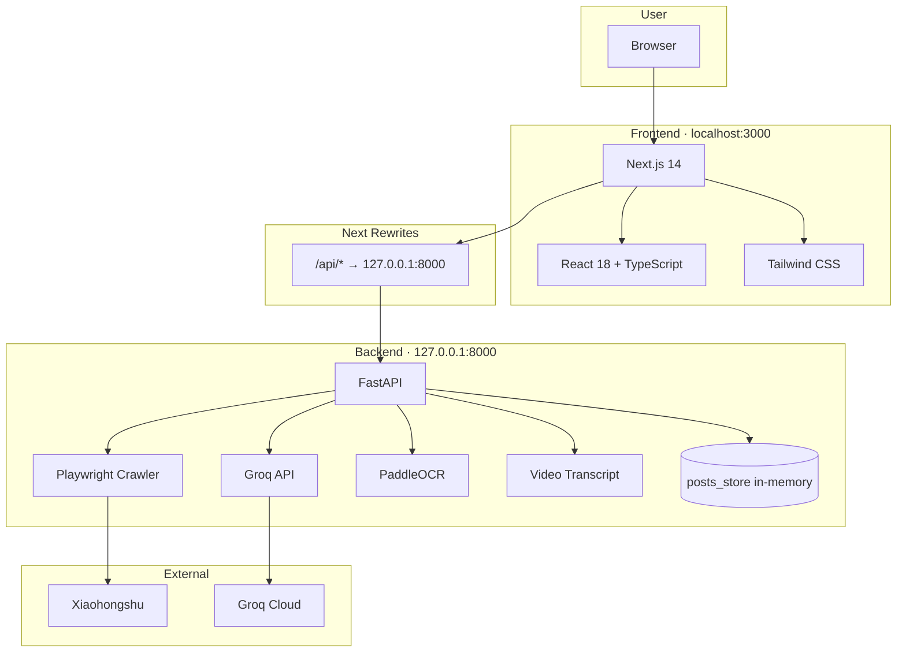
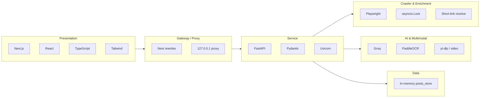
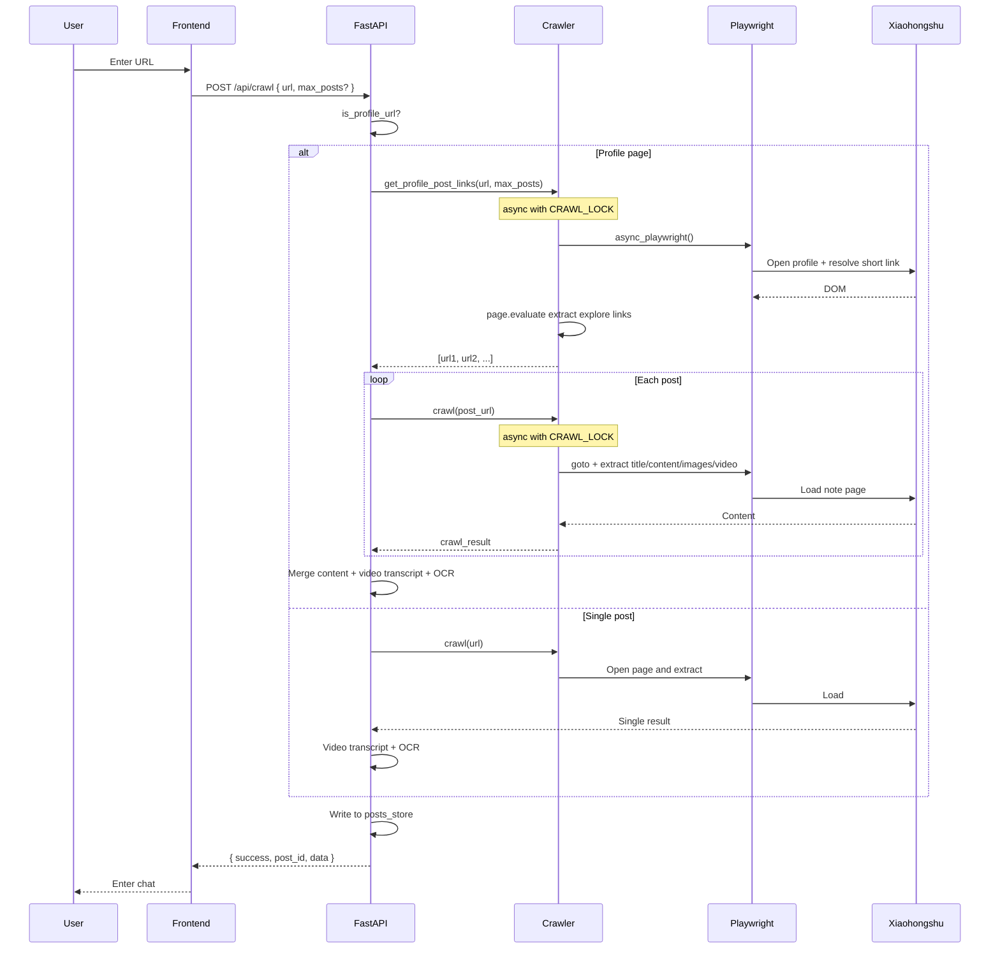
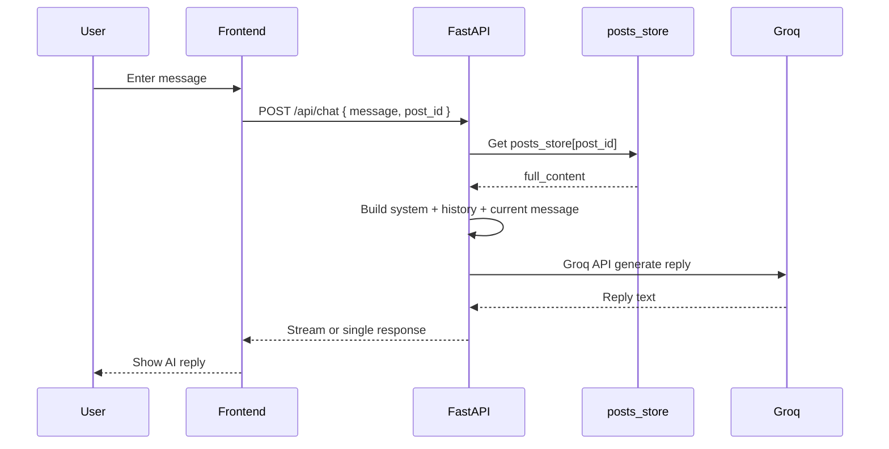

# RedNote (Xiaohongshu AI Chat) — Technology Roadmap

## 1. System Architecture Overview



---

## 2. Tech Stack by Layer



---

## 3. Crawl Flow (/api/crawl)



---

## 4. Chat Flow (/api/chat)



---

## 5. Technology Summary

| Layer   | Technology        | Description |
|---------|-------------------|-------------|
| Frontend| Next.js 14        | React framework, App Router, rewrites proxy |
| Frontend| React 18          | UI and interaction |
| Frontend| TypeScript        | Types and interfaces |
| Frontend| Tailwind CSS      | Styling |
| Backend | FastAPI           | API, validation, error handling |
| Backend | Uvicorn           | ASGI server |
| Crawler | Playwright (async)| Browser automation, short-link resolve, DOM extraction |
| Crawler | asyncio.Lock      | Global lock, one browser task at a time |
| AI      | Groq              | LLM chat |
| Multimodal | PaddleOCR     | Image text recognition |
| Multimodal | yt-dlp / video | Video download and transcript (optional faster-whisper) |
| Tooling | python-dotenv     | Environment variables |
| Tooling | requests         | Short-link HTTP resolve |

---

## 6. How to View the Diagrams

### In Cursor / VS Code (recommended)

1. **Open this file**  
   Click `TECH_ROADMAP.md` in the file tree, or press `Cmd+P` (Mac) / `Ctrl+P` (Windows) and type `TECH_ROADMAP`.

2. **Open Markdown preview**  
   - Shortcut: **`Cmd+Shift+V`** (Mac) or **`Ctrl+Shift+V`** (Windows)  
   - Or: right-click this file → **Open Preview**  
   - Or: click the “Open preview to the side” icon in the editor toolbar

3. **If Mermaid diagrams don’t render**  
   Install one of these extensions and reopen the preview:  
   - **Markdown Preview Mermaid Support** (search for `Mermaid` or `bierner.markdown-mermaid`)  
   - Or **Mermaid** (by Mermaid)

4. **Side-by-side live preview**  
   `Cmd+K V` (Mac) or `Ctrl+K V` (Windows) to open preview in the side; diagrams update as you edit.

### Other options

- **GitHub**: Push the repo and open this file in the repo; Mermaid will render there.
- **Online**: Copy a ` ```mermaid ` code block into [Mermaid Live Editor](https://mermaid.live) to view or export as PNG/SVG.
